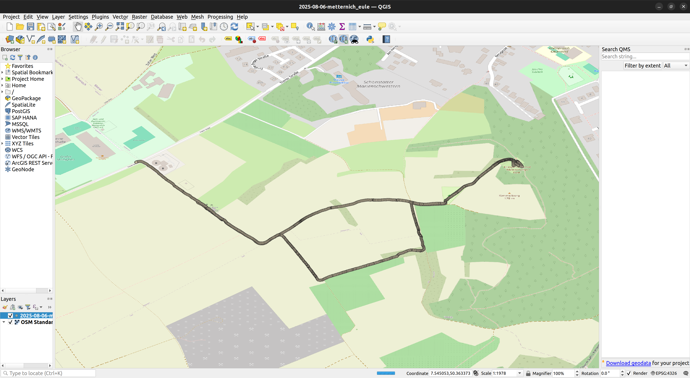

# Visualizing `sensor_msgs/NavSatFix` in ROS 2 Jazzy with QGIS



This guide shows how to convert ROS 2 `NavSatFix` messages from a bag file into CSV
and visualize them in **QGIS** with OSM basemap.

It is designed to be **simple and reproducible** inside a Docker container.

### Repository structure:
```bash
visualize_navsatfix/
├── bag_files                                   # for ros2 bags
│   └── metternich_eule                         # example bag dir
│       ├── 2025-08-06-metternich_eule_0.mcap
│       └── metadata.yaml
├── Dockerfile                                  # container build
├── docker.sh                                   # launch script
├── docs
│   └── qgis_vis.png
├── export_gps.py                               # export script
├── output                                      # for csv output
│   └── metternich_eule.csv                     # example output
└── README.md
```

## Requirements
- [Docker](https://docs.docker.com/desktop/) (tested with [osrf/ros:jazzy-desktop-full](https://hub.docker.com/r/osrf/ros))
- A ros2 bag file containing `sensor_msgs/msg/NavSatFix`

## Usage
### 1. Clone this repository:
```bash
git clone https://github.com/gabrielhansmann/visualize_navsatfix.git
```
### 2. Run the `docker.sh` script with your specific paths:
```bash
sudo bash docker.sh [BAG_PATH] [TOPIC] [CONTAINER_NAME]
```
- `BAG_PATH`: path to the bag dir (has to be inside the repo)
- `TOPIC`: topic inside the bag dir with type `sensor_msgs/msg/NavSatFix`
- `CONTAINER`: [optional] container name

## Visualize with QGis:
### 1. Install QGis:
```bash
sudo apt update
sudo apt install qgis qgis-plugin-grass
```
### 2. Open qgis:
```bash
qgis
```
### 3. In qgis go to:
1. Layer -> Add Layer -> Add Delimited Text Layer
2. File name is the generated csv file in `./output`.
3. Encoding: UTF-8
4. File Format: CSV (comma seperated values)
5. Geometry definition: X=latitude, Y=longitude, Geometry CRS: Project CRS: EPSG:4326 - WGS 84
6. Add the Layer

### 4. For a map underneath in qgis:
1. Plugins -> Manage and Install Plugins
2. Install Plugin QuickMapServices
3. Web -> QuickMapServices -> OSM -> OSM Standard

### 5. To generate a path through the points:
1. Processing -> Toolbox
2. Vector creation -> Points to path
